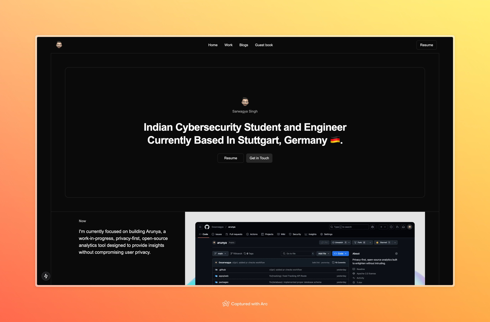

<!-- Improved compatibility of back to top link: See: https://github.com/othneildrew/Best-README-Template/pull/73 -->

<!-- PROJECT LOGO -->
 

  

  <h3 align="center">
    Site
  </h3>
  

    My portfolio website. Built with NextJS. Inspired Heavily from <a href="http://www.youtube.com/@AnthonySistilli">Anthony Sistilli's Portfolio Streams</a>
     
     
    <a href="https://0xsarwagya.codes"><strong>Visit Website »</strong></a>
  

<h3 align="center">
    Preview
</h3>

This is A Very Crude Repo. I Will Keep Improving It Over Time This Is Just To Make Sure it gets Pushed :)   

